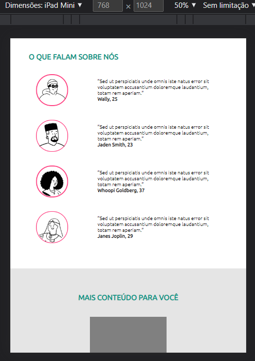
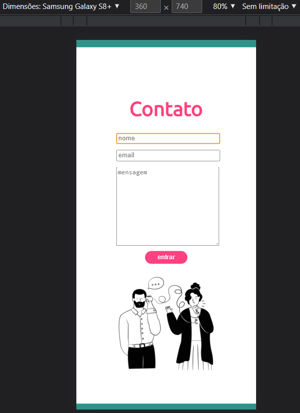

# Projeto DINDIN - Gama Academy - XP 44

## Sobre a Gama Academy
 
Empresa de educação que prepara talentos para o mercado digital. Em seus programas educacionais, as pessoas participantes enfrentam desafios reais, se conectam com empresas digitais, recebem mentorias de profissionais que estão mandando bem em suas áreas e, ainda têm a oportunidade de ensinar e aprender com a nossa comunidade visando o emprego, transição de carreira e o life long learning.

 

## Sobre o Gama Experience

 
É um curso com duração de 6 meses, com o objetivo de formar os melhores juniores do mercado, nas áreas de Desenvolvimento Web e Designers UX/UI! A primeira versão do curso foi lançada pela Gama Academy em 2016 e já empregou mais de 3.000 pessoas.  A versão atual contém mais de 810 horas de aulas, desafios e mentorias, com foco na  empregabilidade de nossos estudantes!

 

## Sobre o Projeto

 
A empresa fictícia DINDIN, quer lançar uma plataforma de conteúdo sobre Educação Financeira e você foi
contratado como dev para criar essa plataforma.

Já temos o layout pronto de todas as páginas, mas precisamos que você desenvolva o site com HTML e
CSS.

 

## Entregável

 
1. As páginas devem ser responsivas, se adaptando bem para desktop, tablet e smartphones.  
2. Os links devem ser configurados para permitir a navegação entre as páginas.  
3. O site deve ser disponibilizado no Github Pages, com todas as imagens renderizando corretamente.   

## Verificações Utilizadas

 
ESLint - para verificação de sintaxe e identação de código.   

## Testes de Responsividade

 
Foi utilizada a própria barra de ferramentas de dispositivo do menu inspecionar do Google Chrome e testado nas seguintes telas de Dispositivo:   

* iPhone SE (375 x 667) 
* iPhone XR (414 x 896)
* iPhone 12 Pro (390 x 844)
* Pixel 5 (393 x 851)
* Samsung Galaxy S8+ (360 x 740)
* Samsung Galaxy S20 Ultra (412 x 915)
* iPad Air (820 x 1180)
* iPad Mini (768 x 1024)
* Surface Pro 7 (912 x 1368)
* Suface Duo (540 x 720)
* Galaxy Fold (280 x 653)
* Samsung Galaxy A51/71 (412 x 914)
* Nest Hub (1024 x 600)
* Nest Hub Max (1280 x 800)

 
A responsividade funcionou bem em todas as páginas criadas e em todas as simulações de tela
  

## Prints de Tela
 

 

 

